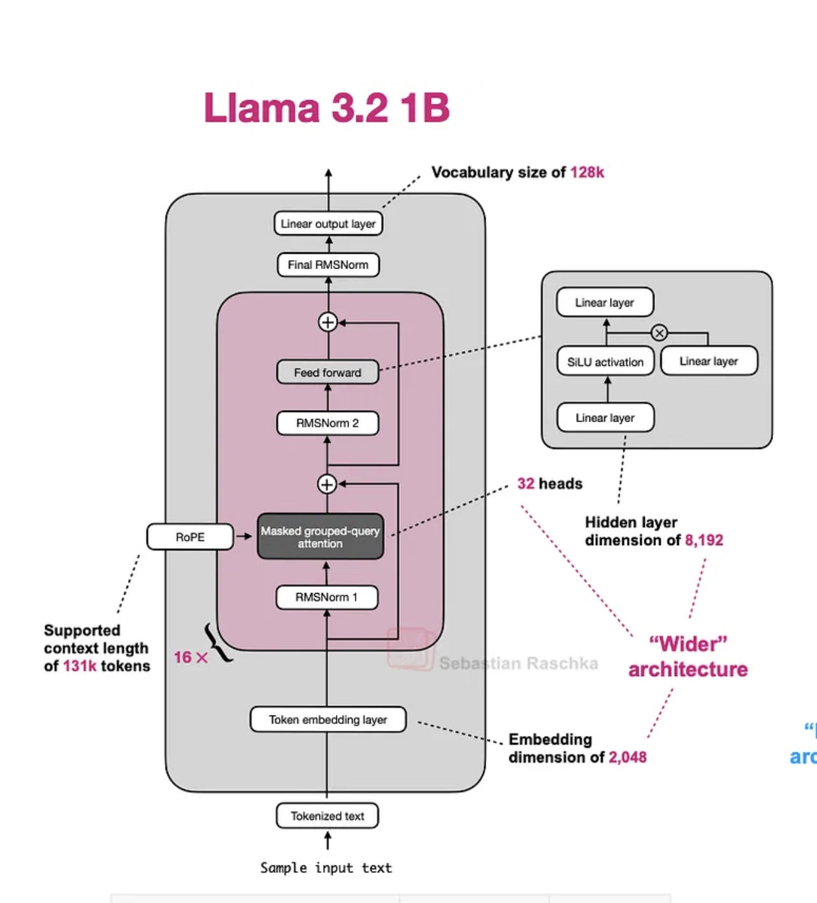

# tiny-infer 🚀

**A minimal but real CUDA inference engine for Llama 3.2 1B — built from scratch, benchmarked honestly, written up publicly.**

> Building a production-grade LLM inference engine in 60 days. One hour per day. Every day of work moves a number.

---

## What This Is

A ground-up implementation of an inference engine for Llama 3.2 1B Instruct in C++ and CUDA, covering the entire stack:

- **Week 1-2:** Correctness (weight loading → forward pass → generation loop)
- **Week 3:** Custom kernels (Flash Attention, fused RMSNorm, RoPE)
- **Week 4:** Paged KV cache (memory-efficient attention)
- **Week 5-6:** Speculative decoding (1.5-2x speedup at batch size 1)
- **Week 7-8:** INT8 KV cache quantization (50% memory reduction)

**Not** a framework. **Not** a rewrite of vLLM. A teaching project that goes from first principles to measurable performance gains — with every step validated and benchmarked.

---

## The North Star

Every day of work moves one of these numbers:

| Metric | Baseline Target | Optimized Target |
|--------|-----------------|------------------|
| **Tokens/sec** (greedy, bs=1) | > 5 tok/s | > 40 tok/s |
| **Time-to-first-token** | measured | measurably reduced |
| **Memory** (4096 ctx) | measured | < 50% of baseline |
| **Speculative speedup** | — | > 1.5x at bs=1 |

If it doesn't move a number or unblock moving a number, we've drifted. This is the forcing function of the entire project.

---

## The Vision

### Phase 1: Week 1-2 ✅ (In Progress)
Build a working engine that outputs the correct tokens.

- [x] Weight loading from `safetensors`
- [x] Embedding lookup kernel
- [x] RMSNorm kernel
- [x] RoPE (Rotary Position Embedding)
- [x] Naive attention (understanding the baseline)
- [x] SwiGLU FFN
- [x] Single forward pass matching HuggingFace
- [ ] Autoregressive generation loop
- [ ] Baseline benchmark harness

### Phase 2: Week 3 🔄 (Next)
Replace naive ops with custom kernels.

- [ ] Flash Attention integration
- [ ] Fused residual + RMSNorm
- [ ] Fused RoPE
- [ ] Full benchmark after optimization
- [ ] Blog post 1: "Building a Minimal LLM Inference Engine in CUDA"

### Phase 3: Week 4
Paged KV cache — the memory optimization.

- [ ] Block allocator
- [ ] Block table
- [ ] Paged attention kernel
- [ ] Memory benchmark (static vs paged)

### Phase 4: Week 5-6
Speculative decoding — the throughput killer.

- [ ] Draft model integration
- [ ] Parallel verification pass
- [ ] Acceptance/rejection sampling
- [ ] K sweep and prompt type analysis
- [ ] Blog post 2: "Speculative Decoding From Scratch — What the Benchmarks Show"

### Phase 5: Week 7-8
INT8 KV cache quantization + final polish.

- [ ] INT8 write/dequantize kernels
- [ ] Quality vs memory tradeoff analysis
- [ ] Full stack benchmark table
- [ ] Blog post 3: "INT8 KV Quantization — Halving Memory With Measurable Tradeoffs"
- [ ] Public code release + writeup

---

## Architecture

**Llama 3.2 1B Instruct — The Model**



**Inference Engine Stack**

```
┌─────────────────────────────────────────┐
│       Autoregressive Generation         │
│      (Decode Loop + Sampling)           │
└──────────────┬──────────────────────────┘
               │
┌──────────────▼──────────────────────────┐
│          Transformer Forward             │
│  ┌─────────────────────────────────┐   │
│  │ RMSNorm → Attention → Residual  │×32│
│  │ RMSNorm → FFN → Residual        │   │
│  └─────────────────────────────────┘   │
│                                         │
│  [Custom Kernels]                       │
│  • Flash Attention                      │
│  • Fused RMSNorm + Residual             │
│  • Fused RoPE                           │
└──────────────┬──────────────────────────┘
               │
┌──────────────▼──────────────────────────┐
│          KV Cache Management             │
│  ┌─────────────────────────────────┐   │
│  │ Static → Paged → INT8 Quantized │   │
│  └─────────────────────────────────┘   │
└──────────────┬──────────────────────────┘
               │
┌──────────────▼──────────────────────────┐
│       Weight Loading (safetensors)      │
│       & Memory Management               │
└─────────────────────────────────────────┘
```

---

## Repository Structure

```
tiny-infer/
├── src/
│   ├── main.cu              # Entry point
│   ├── model.cu             # Transformer forward pass
│   ├── attention.cu         # Attention kernel (naive + Flash)
│   ├── kv_cache.cu          # KV cache management
│   ├── rms_norm.cu          # Fused RMSNorm kernel
│   ├── rope.cu              # Fused RoPE kernel
│   ├── gemm.cu              # GEMM wrapper (cuBLAS)
│   ├── loader.cu            # safetensors weight loader
│   └── kernels.cu           # FFN, sampling, utility kernels
├── include/
│   ├── model.h              # Model struct and interface
│   ├── loader.h             # Weight loading interface
│   └── [kernel headers]
├── validation/
│   ├── validate_embedding.py   # Embedding correctness
│   ├── validate_rms_norm.py    # RMSNorm correctness
│   └── validate_rope.py        # RoPE correctness
├── docker/
│   ├── Dockerfile           # Build environment
│   └── run.sh               # Run container
├── docs/
│   └── llama_3_2.png        # Architecture diagram
├── benchmarks/
│   └── bench.sh             # Reproducible benchmark
├── results/
│   └── README.md            # Running benchmark table
├── ROADMAP.md               # Detailed 60-day plan
├── BLOG.md                  # Blog post drafts
├── CMakeLists.txt           # Build configuration
├── requirements.txt         # Python dependencies
└── README.md                # This file
```

---

## Building

### Prerequisites

- **NVIDIA GPU:** A100, H100, or RTX series with CUDA compute capability 8.0+
- **CUDA Toolkit:** 12.0+
- **cuDNN:** 8.9+ (optional, for future implementations)
- **CMake:** 3.20+
- **Python:** 3.10+ (for tokenizer validation only)

### Quick Start

**1. Clone and setup:**
```bash
git clone https://github.com/venkatakesavvenna/tiny-infer.git
cd tiny-infer
mkdir build
cd build
```

**2. Configure:**
```bash
cmake .. \
  -DCUDA_TOOLKIT_ROOT_DIR=/path/to/cuda \
  -DCMAKE_BUILD_TYPE=Release
```

**3. Build:**
```bash
make -j$(nproc)
```

**4. Download model weights:**
```bash
# Download Llama 3.2 1B safetensors from HuggingFace
# https://huggingface.co/meta-llama/Llama-3.2-1B-Instruct
# Place model.safetensors in the project root
```

**5. Run:**
```bash
./build/tiny-infer
```

### Docker

```bash
cd docker
./run.sh
```

---

## Running Validation

Each component has a corresponding validation script that compares against HuggingFace transformers:

```bash
# Validate embeddings
python validation/validate_embedding.py

# Validate RMSNorm
python validation/validate_rms_norm.py

# Validate RoPE
python validation/validate_rope.py
```

All validations must pass **before** moving to the next phase. Correctness first, speed second.

---

## Benchmarking

### Baseline Benchmark (Day 10 target)

```bash
./benchmarks/bench.sh
```

This runs:
- Forward pass latency
- Tokens/sec (greedy generation)
- Peak GPU memory usage
- Across prompt lengths: 16, 64, 256, 512

### Current Results

See `results/README.md` for the running benchmark table. Updated weekly.

---

## The Rules

1. **Correctness before speed.** Output must match HuggingFace to float32 tolerance before any optimization.
2. **Every stage ends with a number.** Tokens/sec, memory usage, perplexity — measurable.
3. **Don't reimplement what doesn't teach.** Use HF tokenizers, safetensors loading. The learning is in the compute path.
4. **When stuck, post in GPU Mode.** Don't debug silently for three days.
5. **Commit daily.** The git log is the learning log.

---

## Blog Posts

As the project progresses, long-form technical writeups will be published:

- **Post 1 (Week 4):** "Building a Minimal LLM Inference Engine in CUDA"  
  *The foundation: weight loading, forward pass, baseline generation loop.*

- **Post 2 (Week 6):** "Speculative Decoding From Scratch — What the Benchmarks Actually Show"  
  *The surprising part: acceptance rates by prompt type, batch size crossover, the math made concrete.*

- **Post 3 (Week 8):** "INT8 KV Quantization — Halving Memory With Measurable Quality Tradeoffs"  
  *The final piece: where quantization helps, where it hurts, and the combined picture.*

All posts include code snippets, benchmark tables, and Nsight screenshots.

---

## What This Is Not

- **Not a framework.** No abstractions, no plugin system. This is one engine, one model, one set of decisions.
- **Not production-ready.** No batching, no beam search, no streaming. Single GPU, single sequence.
- **Not a vLLM rewrite.** Different design decisions, different tradeoffs. The purpose is learning, not replacing.
- **Not a tutorial series.** These are blog posts about a real project, not step-by-step guides.

---

## Roadmap

See `ROADMAP.md` for the complete 60-day execution plan with daily checkpoints, technical milestones, and the specific math you'll work through.

**TL;DR:**
- **Week 1-2:** Get a working engine (verify outputs match HF)
- **Week 3:** Plug in custom kernels (Flash Attn, fused ops)
- **Week 4:** Paged KV cache (memory optimization)
- **Week 5-6:** Speculative decoding (throughput optimization)
- **Week 7-8:** INT8 KV quantization + final benchmarks
- **Weeks 8+:** Publish blog posts + release publicly

---

## References

### Papers (in reading order)

1. Vaswani et al. — "Attention Is All You Need" (2017)
2. Dao et al. — "Flash Attention" (2022)
3. Kwon et al. — "Efficient Memory Management for LLM Serving with PagedAttention" (2023)
4. Leviathan et al. — "Fast Inference from Transformers via Speculative Decoding" (2023)
5. Xiao et al. — "SmoothQuant" (2022), Section 3

### Reference Codebases

- **tiny-vllm:** github.com/jmaczan/tiny-vllm — structure and weight loading patterns
- **llm.c:** github.com/karpathy/llm.c — clean C/CUDA style reference
- **vLLM source:** csrc/attention/ — paged attention implementation

### Profiling Tools

```bash
# Timeline profiling
nsys profile ./build/tiny-infer

# Kernel-level profiling
ncu --set full ./build/tiny-infer

# Live memory monitoring
nvidia-smi --query-gpu=memory.used --format=csv -l 1
```

---

## Community

Questions? Ideas? Stuck?

- **GPU Mode Discord** — post benchmarks, ask specific kernel questions
- **FlashInfer Slack** — for attention kernel deep dives
- **GitHub Issues** — for bugs and architecture questions

---

## Progress Tracking

Check `results/README.md` for the weekly checkpoint template. Every Sunday:

```
## Week N Checkpoint

### What I built this week
- [List of milestones]

### Benchmark numbers
| Metric | This week | Last week | Baseline |
| Tokens/sec | ? | ? | ? |

### What surprised me
- [Key insight]

### What I'm stuck on
- [Blocker, if any]
```

---

## License

MIT (because the learning is the value, not the code)

---

## Getting Started Right Now

1. Read `ROADMAP.md` — this is the plan
2. Build the project (instructions above)
3. Run validation scripts — confirm your setup works
4. Check `results/README.md` — see the benchmark table
5. Look at `src/main.cu` — this is where the action is
6. Pick a phase from the roadmap and dig in

**Start with Week 1's forward pass validation.** Get one number working correctly. Then move to the next.

---

**Built with 🔥 CUDA, ❤️ care for clean code, and 📊 honest benchmarks.**

*One hour per day. Sixty days. One working inference engine.*
